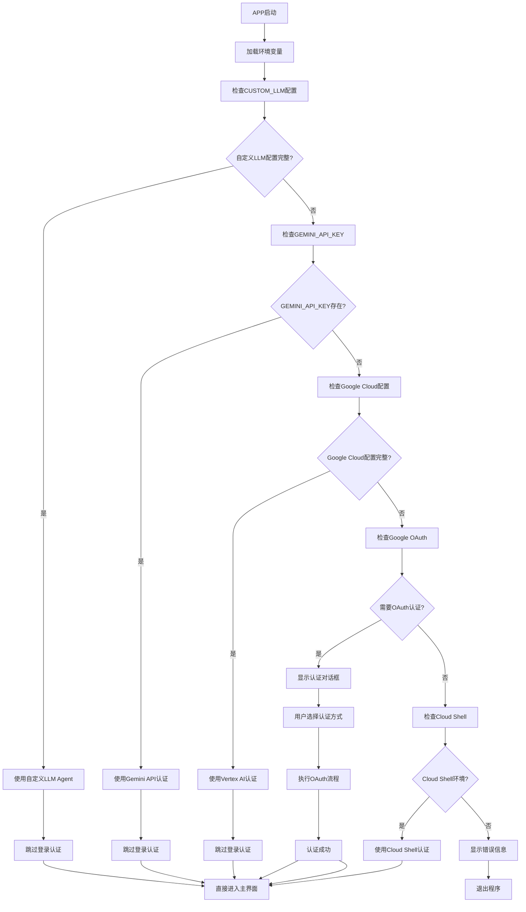
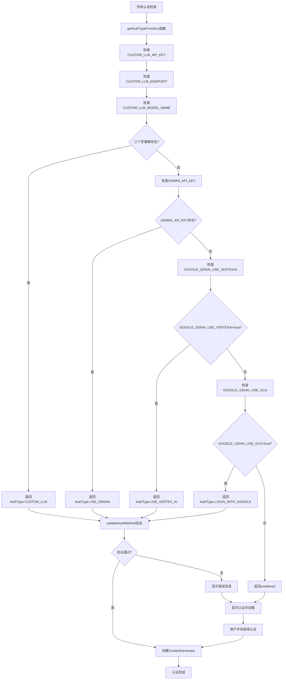
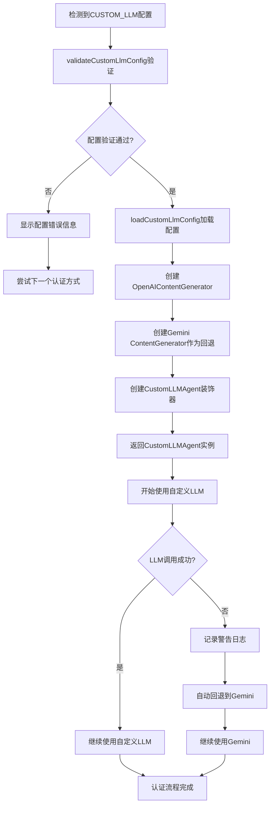
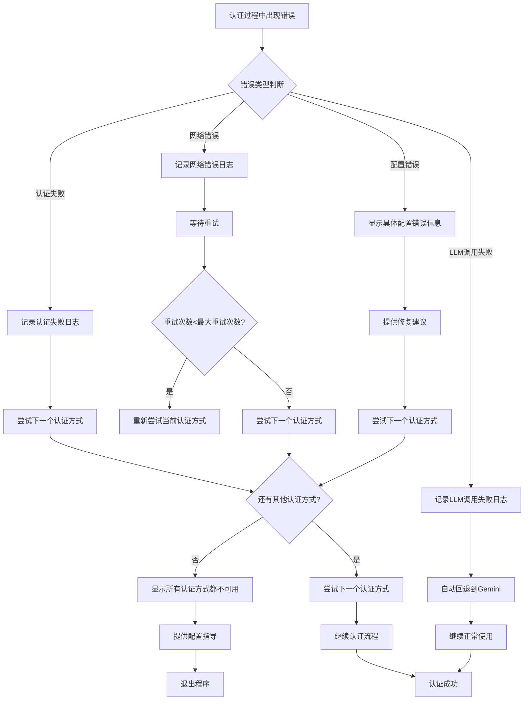

# QFlow CLI 登录认证优先级改造 PRD

## 项目概述

### 背景

当前 Gemini CLI 的认证流程需要用户手动选择认证方式，我们希望实现自动化的认证优先级检查，当检测到自定义LLM配置时，优先使用自定义Agent，无需用户登录认证。

### 目标

- 实现自动化的认证优先级检查
- 当有 `.env` 文件或环境变量中的 `CUSTOM_LLM_*` 参数时，自动跳过登录认证
- 保持向后兼容，不影响现有功能
- 最小化对原有代码的修改

## 功能需求

### 1. 认证优先级顺序

按以下优先级自动选择认证方式：

1. **自定义LLM** (CUSTOM*LLM*\* 配置完整)
   - 检查环境变量：`CUSTOM_LLM_API_KEY`、`CUSTOM_LLM_ENDPOINT`、`CUSTOM_LLM_MODEL_NAME`
   - 如果配置完整，直接使用自定义Agent，跳过登录认证

2. **Gemini API Key** (GEMINI_API_KEY)
   - 检查环境变量：`GEMINI_API_KEY`
   - 如果存在，使用Gemini API认证

3. **Google Cloud** (GOOGLE_API_KEY 或 GOOGLE_CLOUD_PROJECT + GOOGLE_CLOUD_LOCATION)
   - 检查环境变量：`GOOGLE_API_KEY` 或 `GOOGLE_CLOUD_PROJECT` + `GOOGLE_CLOUD_LOCATION`
   - 如果存在，使用Vertex AI认证

4. **Google OAuth** (LOGIN_WITH_GOOGLE)
   - 默认OAuth登录方式

5. **Cloud Shell** (CLOUD_SHELL=true)
   - 特殊环境下的认证方式

### 2. 自动认证检查

- 在APP启动时自动检查环境变量
- 如果检测到自定义LLM配置，直接使用，不显示认证对话框
- 如果自定义LLM配置不完整，自动尝试下一个优先级
- 只有在所有认证方式都不可用时才显示认证对话框

### 3. 优雅降级

- 自定义LLM配置不完整时，自动尝试其他认证方式
- 自定义LLM调用失败时，自动回退到Gemini
- 提供清晰的日志信息，说明当前使用的认证方式

## 启动并登录流程

### 整体流程图



### 详细认证检查流程



### 自定义LLM认证流程



### 错误处理和降级流程



## 技术方案

### 架构设计

采用**优先级检查 + 最小化修改**的策略：

1. **优先级检查**：在现有认证流程前添加自定义LLM检查
2. **最小化修改**：只修改认证相关的核心文件
3. **保持向后兼容**：不影响现有代码逻辑和功能
4. **优雅降级**：自定义LLM失败时自动回退到Gemini

### 核心修改文件

```text
packages/core/src/core/
├── contentGenerator.ts          # 添加 CUSTOM_LLM AuthType
├── customLlmAuth.ts            # 自定义LLM认证配置 ✅
├── customLlmAgent.ts           # 自定义LLM代理类 ✅
└── openaiContentGenerator.ts   # OpenAI兼容的ContentGenerator ✅

packages/cli/src/
├── config/auth.ts              # 添加自定义LLM认证验证
├── validateNonInterActiveAuth.ts # 添加自定义LLM优先级检查
└── ui/hooks/useAuthCommand.ts  # 修改认证流程逻辑
```

### 实现步骤

#### 步骤1：添加CUSTOM_LLM认证类型

在 `packages/core/src/core/contentGenerator.ts` 中添加：

```typescript
export enum AuthType {
  LOGIN_WITH_GOOGLE = 'oauth-personal',
  USE_GEMINI = 'gemini-api-key',
  USE_VERTEX_AI = 'vertex-ai',
  CLOUD_SHELL = 'cloud-shell',
  CUSTOM_LLM = 'custom-llm', // 新增
}
```

#### 步骤2：修改认证优先级检查

在 `packages/cli/src/validateNonInterActiveAuth.ts` 中修改 `getAuthTypeFromEnv()` 函数：

```typescript
function getAuthTypeFromEnv(): AuthType | undefined {
  // 1. 优先检查自定义LLM配置
  if (
    process.env['CUSTOM_LLM_API_KEY'] &&
    process.env['CUSTOM_LLM_ENDPOINT'] &&
    process.env['CUSTOM_LLM_MODEL_NAME']
  ) {
    return AuthType.CUSTOM_LLM;
  }

  // 2. 检查Gemini API Key
  if (process.env['GEMINI_API_KEY']) {
    return AuthType.USE_GEMINI;
  }

  // 3. 检查Google Cloud配置
  if (process.env['GOOGLE_GENAI_USE_VERTEXAI'] === 'true') {
    return AuthType.USE_VERTEX_AI;
  }

  // 4. 检查Google OAuth
  if (process.env['GOOGLE_GENAI_USE_GCA'] === 'true') {
    return AuthType.LOGIN_WITH_GOOGLE;
  }

  return undefined;
}
```

#### 步骤3：添加自定义LLM认证验证

在 `packages/cli/src/config/auth.ts` 中添加：

```typescript
export function validateAuthMethod(authMethod: string): string | null {
  loadEnvironment(loadSettings().merged);

  // 添加自定义LLM验证
  if (authMethod === AuthType.CUSTOM_LLM) {
    const { validateCustomLlmConfig } = await import('@google/gemini-cli-core');
    const validation = validateCustomLlmConfig();
    if (!validation.isValid) {
      return validation.errors.join('\n');
    }
    return null;
  }

  // ... 现有验证逻辑
}
```

#### 步骤4：修改ContentGenerator创建逻辑

在 `packages/core/src/core/contentGenerator.ts` 中修改 `createContentGeneratorConfig()` 函数：

```typescript
export function createContentGeneratorConfig(
  config: Config,
  authType: AuthType | undefined,
): ContentGeneratorConfig {
  // ... 现有逻辑

  // 添加自定义LLM配置
  if (authType === AuthType.CUSTOM_LLM) {
    const { loadCustomLlmConfig } = await import('./customLlmAuth.js');
    const customConfig = loadCustomLlmConfig();
    if (customConfig) {
      contentGeneratorConfig.model = customConfig.modelName;
      contentGeneratorConfig.customLlmConfig = customConfig;
    }
    return contentGeneratorConfig;
  }

  // ... 现有逻辑
}
```

#### 步骤5：修改ContentGenerator创建逻辑

在 `packages/core/src/core/contentGenerator.ts` 中修改 `createContentGenerator()` 函数：

```typescript
export async function createContentGenerator(
  config: ContentGeneratorConfig,
  gcConfig: Config,
  sessionId?: string,
): Promise<ContentGenerator> {
  // 如果配置了自定义LLM，创建CustomLLMAgent
  if (config.authType === AuthType.CUSTOM_LLM && config.customLlmConfig) {
    const { CustomLLMAgent } = await import('./customLlmAgent.js');
    const { OpenAIContentGenerator } = await import(
      './openaiContentGenerator.js'
    );

    // 创建Gemini ContentGenerator作为回退
    const geminiGenerator = await createGeminiContentGenerator(
      config,
      gcConfig,
      sessionId,
    );

    // 创建自定义LLM ContentGenerator
    const customGenerator = new OpenAIContentGenerator(config.customLlmConfig);

    // 返回装饰器模式的CustomLLMAgent
    return new CustomLLMAgent(geminiGenerator, customGenerator);
  }

  // ... 现有逻辑
}
```

### 配置示例

#### .env 文件配置

```bash
# 自定义LLM配置（优先级最高）
CUSTOM_LLM_API_KEY=sk-xxx
CUSTOM_LLM_ENDPOINT=https://apis.iflow.cn/v1
CUSTOM_LLM_MODEL_NAME=deepseek-v3.1
CUSTOM_LLM_TEMPERATURE=0.7
CUSTOM_LLM_MAX_TOKENS=4096

# 其他认证方式（作为回退）
GEMINI_API_KEY=your-gemini-key
GOOGLE_API_KEY=your-google-key
GOOGLE_CLOUD_PROJECT=your-project
GOOGLE_CLOUD_LOCATION=us-central1
```

#### 环境变量配置

```bash
export CUSTOM_LLM_API_KEY="sk-xxx"
export CUSTOM_LLM_ENDPOINT="https://apis.iflow.cn/v1"
export CUSTOM_LLM_MODEL_NAME="deepseek-v3.1"
```

## 测试方案

### 1. 单元测试

- 测试认证优先级检查逻辑
- 测试自定义LLM配置验证
- 测试优雅降级机制

### 2. 集成测试

- 测试完整的认证流程
- 测试自定义LLM调用和回退
- 测试不同环境变量组合

### 3. 用户测试

- 测试不同认证方式的切换
- 测试配置错误时的错误处理
- 测试用户体验的流畅性

## 风险评估

### 1. 技术风险

- **低风险**：修改量小，主要是添加新的认证类型和优先级检查
- **向后兼容**：不影响现有功能，只是添加新的认证方式

### 2. 用户体验风险

- **低风险**：用户体验更好，自动选择认证方式
- **降级机制**：即使自定义LLM失败，也能回退到Gemini

### 3. 维护风险

- **低风险**：代码结构清晰，易于维护
- **文档完善**：提供详细的配置说明和错误处理

## 实施计划

### 阶段1：核心功能开发（1-2天）

1. 添加CUSTOM_LLM认证类型
2. 修改认证优先级检查逻辑
3. 添加自定义LLM认证验证

### 阶段2：集成测试（1天）

1. 测试认证流程
2. 测试优雅降级
3. 修复发现的问题

### 阶段3：文档和优化（0.5天）

1. 更新文档
2. 优化用户体验
3. 代码审查

## 总结

这个方案通过最小化的代码修改，实现了自动化的认证优先级检查，当检测到自定义LLM配置时自动跳过登录认证，同时保持了向后兼容性和优雅降级机制。用户只需要配置环境变量，就能自动使用自定义Agent，大大提升了用户体验。

## 详细实现分析

### 当前认证流程分析

基于代码分析，当前的认证流程如下：

1. **启动时检查**：在 `packages/cli/src/gemini.tsx` 的 `main()` 函数中
2. **认证类型检测**：通过 `validateNonInterActiveAuth.ts` 中的 `getAuthTypeFromEnv()` 函数
3. **认证验证**：通过 `config/auth.ts` 中的 `validateAuthMethod()` 函数
4. **UI认证流程**：通过 `ui/hooks/useAuthCommand.ts` 处理交互式认证

### 关键修改点

#### 1. 认证优先级检查逻辑

当前 `getAuthTypeFromEnv()` 函数的检查顺序：

1. GOOGLE_GENAI_USE_GCA → LOGIN_WITH_GOOGLE
2. GOOGLE_GENAI_USE_VERTEXAI → USE_VERTEX_AI
3. GEMINI_API_KEY → USE_GEMINI

需要修改为：

1. CUSTOM*LLM*\* → CUSTOM_LLM (新增，最高优先级)
2. GEMINI_API_KEY → USE_GEMINI
3. GOOGLE_GENAI_USE_VERTEXAI → USE_VERTEX_AI
4. GOOGLE_GENAI_USE_GCA → LOGIN_WITH_GOOGLE

#### 2. 认证验证逻辑

需要在 `validateAuthMethod()` 中添加对 `CUSTOM_LLM` 类型的验证，调用现有的 `validateCustomLlmConfig()` 函数。

#### 3. ContentGenerator配置

需要在 `ContentGeneratorConfig` 类型中添加 `customLlmConfig` 字段，并在 `createContentGeneratorConfig()` 中处理自定义LLM配置。

#### 4. ContentGenerator创建

需要在 `createContentGenerator()` 中检测到 `CUSTOM_LLM` 类型时，创建 `CustomLLMAgent` 实例，使用装饰器模式包装现有的Gemini ContentGenerator。

### 最小化修改策略

1. **只修改必要的文件**：认证相关的核心文件
2. **保持现有接口不变**：不改变现有的函数签名和接口
3. **向后兼容**：现有功能完全不受影响
4. **优雅降级**：自定义LLM失败时自动回退到Gemini

这种设计确保了：

- 对现有代码的影响最小
- 后续升级时不会影响我们的修改
- 用户体验得到显著提升
- 代码维护成本最低
