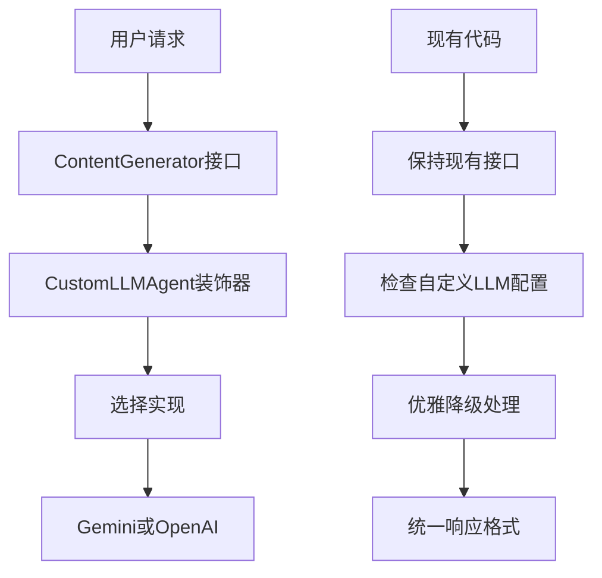

# QFlow CLI 自定义LLM支持改造 PRD

## 项目概述

### 背景

当前 Gemini CLI 只支持 Google 的认证方式（Gemini API Key、Google Cloud、OAuth等），需要改造为支持自定义LLM API，特别是支持 OpenAI 兼容的API接口。

### 目标

- 支持通过环境变量配置自定义LLM API
- 保持向后兼容，不影响现有功能
- 实现优雅降级，避免因配置不完整导致程序退出
- 最小化对原有代码的修改

### 参考项目

基于 [qflow 项目](https://github.com/qiaoliang/qflow) 的实现思路，支持多种LLM提供商。

## 功能需求

### 1. 环境变量支持

支持以下环境变量配置：

```bash
# 必需的环境变量
CUSTOM_LLM_API_KEY=sk-xxx
CUSTOM_LLM_ENDPOINT=https://apis.iflow.cn/v1
CUSTOM_LLM_MODEL_NAME=deepseek-v3.1

# 可选配置
CUSTOM_LLM_TEMPERATURE=0.7
CUSTOM_LLM_TOP_P=1.0
CUSTOM_LLM_MAX_TOKENS=4096
CUSTOM_LLM_TIMEOUT=30000
CUSTOM_LLM_RETRIES=3
CUSTOM_LLM_STREAM_ENABLED=true
```

### 2. 认证优先级

按以下优先级选择认证方式：

1. **自定义LLM** (CUSTOM*LLM*\* 配置完整)
2. **Gemini API Key** (GEMINI_API_KEY)
3. **Google Cloud** (GOOGLE_API_KEY 或 GOOGLE_CLOUD_PROJECT + GOOGLE_CLOUD_LOCATION)
4. **Google OAuth** (LOGIN_WITH_GOOGLE)
5. **Cloud Shell** (CLOUD_SHELL=true)

### 3. 优雅降级

- 如果自定义LLM配置不完整，自动尝试其他认证方式
- 只有在所有认证方式都不可用时才报错退出
- 提供清晰的错误信息和配置指导

## 技术方案

### 架构设计

采用**装饰器模式 + 最小化修改**的策略：

1. **装饰器模式**：通过CustomLLMAgent包装现有ContentGenerator
2. **最小化修改**：只修改contentGenerator.ts一个文件
3. **保持向后兼容**：不影响现有代码逻辑和功能
4. **优雅降级**：自定义LLM失败时自动回退到Gemini

### 核心文件结构

```text
packages/core/src/core/
├── customLlmAuth.ts          # 自定义LLM认证配置 ✅
├── openaiContentGenerator.ts # OpenAI兼容的ContentGenerator ✅
├── customLlmAgent.ts         # 自定义LLM代理（装饰器）🔄
└── contentGenerator.ts       # 修改现有文件（最小改动）🔄
```

### 架构流程图



## 详细实现方案

### 1. 自定义LLM认证配置 (`customLlmAuth.ts`) ✅

```typescript
export interface CustomLlmConfig {
  apiKey: string;
  endpoint: string;
  modelName: string;
  temperature?: number;
  maxTokens?: number;
  topP?: number;
  timeout?: number;
  retries?: number;
  streamEnabled?: boolean;
}

export function loadCustomLlmConfig(): CustomLlmConfig | null;
export function shouldUseCustomLlm(): boolean;
export function validateCustomLlmConfig(): {
  isValid: boolean;
  errors: string[];
};
```

**职责**：

- 从环境变量加载自定义LLM配置
- 验证配置完整性和参数范围
- 提供配置检查函数
- 支持详细的错误信息

### 2. OpenAI兼容ContentGenerator (`openaiContentGenerator.ts`) ✅

```typescript
export class OpenAIContentGenerator implements ContentGenerator {
  constructor(config: CustomLlmConfig);
  async generateContent(
    request: GenerateContentParameters,
    userPromptId: string,
  ): Promise<GenerateContentResponse>;
  async generateContentStream(
    request: GenerateContentParameters,
    userPromptId: string,
  ): Promise<AsyncGenerator<GenerateContentResponse>>;
  async countTokens(
    request: CountTokensParameters,
  ): Promise<CountTokensResponse>;
  async embedContent(
    request: EmbedContentParameters,
  ): Promise<EmbedContentResponse>;
  userTier?: UserTierId;
}
```

**职责**：

- 实现OpenAI API调用和流式响应
- 转换Gemini格式与OpenAI格式
- 处理超时、重试和错误恢复
- 支持所有ContentGenerator接口方法
- 提供完整的类型安全和错误处理
- 支持系统指令和内容格式转换
- 实现token估算和嵌入功能（嵌入功能抛出不支持错误）

### 3. 自定义LLM代理 (`customLlmAgent.ts`) 🔄

```typescript
export class CustomLLMAgent implements ContentGenerator {
  constructor(
    geminiGenerator: ContentGenerator,
    customGenerator?: ContentGenerator,
  );

  async generateContent(
    request,
    userPromptId,
  ): Promise<GenerateContentResponse>;
  async generateContentStream(
    request,
    userPromptId,
  ): Promise<AsyncGenerator<GenerateContentResponse>>;
  async countTokens(request): Promise<CountTokensResponse>;
  async embedContent(request): Promise<EmbedContentResponse>;

  private async tryCustomLlm<T>(operation: () => Promise<T>): Promise<T>;
}
```

**职责**：

- 装饰器模式包装现有ContentGenerator
- 优先使用自定义LLM，失败时回退到Gemini
- 保持所有现有功能和接口不变
- 提供透明的LLM切换

### 4. 最小化修改现有文件

**只需要修改 `packages/core/src/core/contentGenerator.ts`**：

```typescript
// 添加导入
import { CustomLLMAgent } from './customLlmAgent.js';
import { shouldUseCustomLlm, loadCustomLlmConfig } from './customLlmAuth.js';
import { OpenAIContentGenerator } from './openaiContentGenerator.js';

// 在 createContentGenerator 函数末尾添加包装逻辑
export async function createContentGenerator(
  config: ContentGeneratorConfig,
  gcConfig: Config,
  sessionId?: string,
): Promise<ContentGenerator> {
  // ... 现有的所有代码保持不变 ...

  // 创建原有的ContentGenerator
  const originalGenerator = await createOriginalContentGenerator(
    config,
    gcConfig,
    sessionId,
  );

  // 如果配置了自定义LLM，则包装为CustomLLMAgent
  if (shouldUseCustomLlm()) {
    const customConfig = loadCustomLlmConfig();
    if (customConfig) {
      const customGenerator = new OpenAIContentGenerator(customConfig);
      return new CustomLLMAgent(originalGenerator, customGenerator);
    }
  }

  return originalGenerator;
}
```

**优势**：

- 只修改一个文件，风险最小
- 现有代码完全不变
- 向后兼容，无感知切换
- 易于测试和回滚

## 实现优势

### 最小化修改策略

- **只修改1个文件**：`packages/core/src/core/contentGenerator.ts`
- **现有代码不变**：所有业务逻辑、测试、配置都保持不变
- **向后兼容**：没有配置自定义LLM时行为完全一样
- **易于回滚**：出问题时只需要删除几行代码

### 装饰器模式优势

- **透明切换**：用户无感知地使用不同LLM
- **优雅降级**：自定义LLM失败时自动回退到Gemini
- **保持功能**：所有现有功能（rules、上下文管理等）都保持不变
- **易于扩展**：未来可以轻松添加更多LLM提供商

## 实现步骤

### 阶段1：核心模块开发 ✅

1. **创建 `customLlmAuth.ts`** ✅
   - 实现环境变量加载和验证
   - 添加完整的单元测试
   - 支持详细的错误信息
   - 修复默认值配置，与PRD要求一致

2. **创建 `openaiContentGenerator.ts`** ✅
   - 实现OpenAI API调用和流式响应
   - 实现格式转换和错误处理
   - 添加完整的单元测试
   - 修复类型安全和接口兼容性问题
   - 完善错误处理和超时机制

### 阶段2：代理层开发 🔄

1. **创建 `customLlmAgent.ts`** 🔄
   - 实现装饰器模式包装
   - 实现优雅降级机制
   - 保持所有现有功能

### 阶段3：集成修改 🔄

1. **修改 `contentGenerator.ts`** 🔄
   - 添加导入语句（3行）
   - 添加包装逻辑（10行）
   - 保持现有代码不变

### 阶段4：测试与优化

1. **集成测试**
   - 测试各种配置场景
   - 测试优雅降级
   - 测试错误处理

2. **性能优化**
   - 优化API调用性能
   - 添加日志记录

## 总结

本改造方案通过**装饰器模式 + 最小化修改**的策略，实现了对自定义LLM API的支持。方案具有以下优势：

1. **最小风险**：只修改一个文件，现有代码完全不变
2. **完全兼容**：保持所有现有功能和接口
3. **优雅降级**：自定义LLM失败时自动回退到Gemini
4. **易于扩展**：未来可以轻松添加更多LLM提供商
5. **用户友好**：提供清晰的配置指导和错误信息

通过分阶段实施，可以确保项目的稳定性和可维护性。
